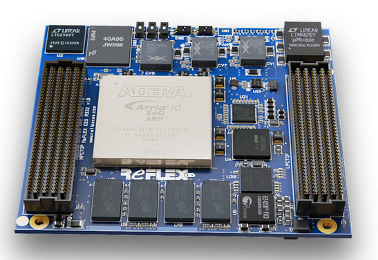
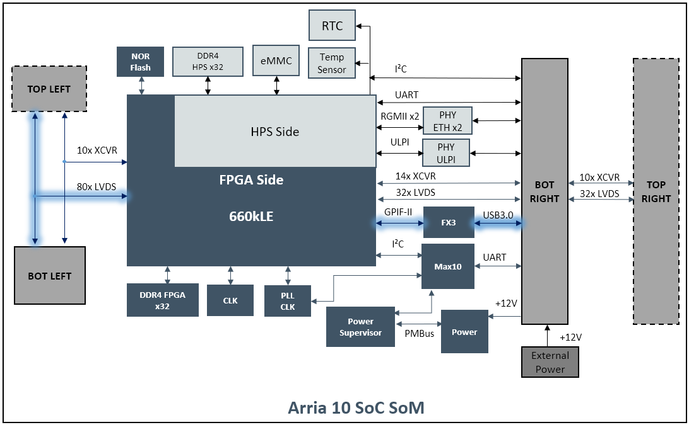
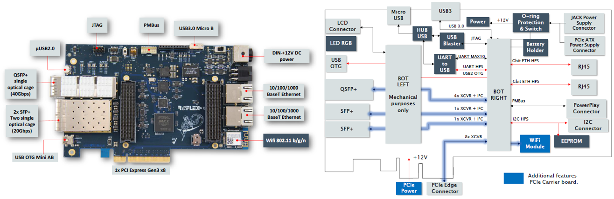

# REFLEX CES Achilles Arria 10 SoC SOM

| Overview | [Start Here](docs/start-here.md) | [Hardware](docs/hardware.md) | [Software](docs/software.md) | [Program eMMC](docs/program-emmc.md) | [Resources](docs/resources.md) |
|:--------:|:--------------------------------:|:----------------------------:|:----------------------------:|:------------------------------------:|:------------------------------:|

The Achilles SoM by [REFLEX CES](https://www.reflexces.com/) features an Altera® Arria® 10 SX SoC FPGA (System-on-Chip Field Programmable Gate Array), including a dual-core ARM® Cortex™-A9 MPCore processor and up to 660K programmable Logic Elements. The Achilles SoM is designed to enable easy integration for end-user applications, providing full flexibility with the Intel® Arria® 10 SX SoC FPGA device. The SOM is available to purchase as part of a development kit for evaluation and prototyping, or as a production-ready module designed into your electronic assembly. The SOM also features industry standard FMC connectors to allow for easy integration of additional connectivity, video interfaces, data converters, and many other options available through FMC daughter cards.

Achilles offers developers an excellent out-of-box experience. The board support package includes full documentation and a suite of reference designs to quickly enable the FPGA development process.

Ideal target markets include Automotive, Video Broadcast, Machine and Intelligent Vision, Industrial, Military, Test & Measurement, and Medical.

There are 6 versions of the SOM available:  

|SOM Version      | v2 Lite         | v2 Indus        | v2 Turbo        | v5 Indus        | v5 Indus 12G    | v5 Lite         |
|-----------------|:---------------:|:---------------:|:---------------:|:---------------:|:---------------:|:---------------:|
|FPGA Density     | 270 KLE         | 660 KLE         | 660 KLE         | 660 KLE         | 660 KLE         | 270 KLE         |
|FPGA Speed Grade | -2              | -1              | -1              | -1              | -1              | -2              |
|DDR4 SDRAM FPGA  | 2 GB, 2133 MT/s | 2 GB, 2400 MT/s | 4 GB, 2400 MT/s | 4 GB, 2400 MT/s | 4 GB, 2400 MT/s | 4 GB, 2133 MT/s |
|DDR4 SDRAM HPS   | 2 GB, 2133 MT/s | 2 GB, 2400 MT/s | 3 GB, 2400 MT/s | 3 GB, 2400 MT/s | 3 GB, 2400 MT/s | 3 GB, 2133 MT/s |
|eMMC             | 8 GB            | 32 GB           | 32 GB           | 32 GB           | 32 GB           | 32 GB           |
|FMC Connectors   | Bottom Only     | Top & Bottom    | Top & Bottom    | Top & Bottom    | Bottom Only     | Bottom Only     |
|Design Status    | EOL             | EOL             | EOL             | Active          | Active          | Active          |

Note: Achilles Development Kit comes with v5 Indus version SOM

### SOM Specifications

#### FPGA
- Arria® 10 SX, 10AS066H2F34I1HG, F34 package, -1 speed grade
- Up to 660K Logic Elements (KLEs) with over 1M registers
- Up to 2,133 M20K memory blocks, offering 42 Mb of memory
- Up to 5.7 Mb of MLAB memory
- Up to 3,376 18 x 19 multipliers providing 1,519 GFLOPS of peak floating-point performance

#### FPGA Hard Processor System (HPS)
- Dual-core ARM® Cortex™-A9 MPCore processor
- Up to 1.5 GHz max processor frequency
- Enhanced with NEON Extension and Single & Double Precision Floating point unit
- 32 KB L1 Instruction & Data Cache
- Shared 512KB L2 Cache
- 256 KB on-chip RAM

#### FPGA Configuration & HPS boot
- AS configuration supported with EPCQL512, remote upgrade support and fail-safe functionality: AS, Configuration via Protocol (CvP)
- Up to 32 GB eMMC for HPS boot flash to store U-Boot, Linux kernel, and root filesystem

#### Communication Interfaces on SOM
- 2x 10/100/1000 Ethernet PHYs connected to HPS
- 1x USB 3.0 device connectivity using Cypress FX3 super speed controller (Indus/Turbo only)
- 1x USB 2.0 Device/Host PHY
- 1x USB OTG support connected to the HPS
- 1x I²C slave interface (HPS can drive external device)
- 1x UART connected to the HPS (UART over USB interface)
- 1x UART connected to System controller (MAX10 / UART over USB interface)
- 1x PCIe Gen3 x8 Hard IP interface routed through FMC

#### Memory
| SOM Version           | v2 Lite    | v2 Indus   | v2 Turbo   | v5 Indus   | v5 Indus 12G | v5 Lite    |
|-----------------------|:----------:|:----------:|:----------:|:----------:|:------------:|:----------:|
| 1 bank on-board DDR4  | 2 GB, x32, | 2 GB, x32, | 4 GB, x32, | 4 GB, x32, | 4 GB, x32,   | 4 GB, x32, |
| connected to FPGA     | 2133 MT/s  | 2400 MT/s  | 2400 MT/s  | 2400 MT/s  | 2400 MT/s    | 2133 MT/s  |
| 1 bank on-board DDR4  | 2 GB, x32, | 2 GB, x32, | 3 GB, x32, | 3 GB, x32, | 3 GB, x32,   | 3 GB, x32, |
| connected to FPGA     | 2133 MT/s  | 2400 MT/s  | 2400 MT/s  | 2400 MT/s  | 2400 MT/s    | 2133 MT/s  |

#### Peripherals
- 1x Real Time Clock (RTC) connected to HPS I²C interface
- 1x Temperature Sensor connected to HPS I²C interface
- 1x EEPROM on Carrier board connected to HPS I²C interface (through FMC bottom right connector)
- 2x User LEDs connected to FPGA I/O
- 2x User LEDs connected to HPS I/O

#### FMC Connectivity Features
- 1x FMC LPC bottom connector with HPS signals and 14 transceivers (Bottom-Right)
- 1x FMC HPC (Indus/Turbo) or LPC (Lite) bottom connector (Bottom-Left)
- Up to 24 transceivers available:
  - 10x XCVR dedicated to FMC HPC Top connector or to the FMC HPC Bottom connector (Top or Bottom-Left)
  - 10x XCVR dedicated to FMC LPC Top connector or to the FMC LPC Bottom connector (Top or Bottom-Right)
  - 4x additional XCVR dedicated to the FMC LPC Bottom connector (Bottom-right)
- LVDS and LVCMOS (1.8V FMC VITA 57.1 compliant)
  - 80 LVDS bidirectional (or 160 Single ended) on FMC HPC Top connector (Top or Bottom-Left)
  - 32 LVDS bidirectional (or 64 Single ended) on FMC LPC Top connector (Top or Bottom-Left)

#### Mechanical & Thermal
- Size: 86 mm x 95mm (3.4" x 3.8")
- Custom heat spreader, heat sink, and fan delivered with every module

##### Achilles SOM Block Diagram

### SOM Carrier Board Options

The Achilles SOM cannot operate stand-alone and requires a carrier card. There are 3 options available:

#### Option 1: Achilles Starter Board (included with purchase of Development Kit)

- Evaluation mode on desktop with AC power supply
- 2x Ethernet RJ-45 connectors
- 1x USB 3.0 Micro B connector (FPGA)
- 1x USB OTG Mini AB (HPS)
- 1x USB micro A connector for UART connection to HPS and MAX 10 System Controller interface and on-board USB Blaster II for FPGA programming
- 1x I²C 4 pin header (HPS)
- 1x PMBus connector for Digital Power System management, configure and interrogate the PSM Devices with LTpowerPlay using the Linear Powerplay DC1613A USB cable (cable not included)
- Size: 100 mm x 140 mm (3.94" x 5.51")

<b>Achilles Starter Board and Block Diagram</b>

#### Option 2: Achilles PCIe Carrier Board (sold separately)

- Evaluation mode plugged into PCIe slot OR on desktop with AC power supply (not included with PCIe Carrier)
- Includes all the interfaces available on the Starter Board, plus:
  - PCIe Gen3 x8 card edge connector * 1x QSFP+ quad optical cage (4 XCVR @ 10.3125 Gbps per link)
  - 2x SFP+ single optical cage (2 XCVR @ 10.3125 Gbps per link)
  - 1x WiFi 802.11 b/g/n IoT module with SPI and SDIO interface to host controller
  - 1x 10 pin LCD connector * Size: PCIe Standard height, half length - 111.15 mm x 167.65 mm (4.38" x 6.60")

<b>Achilles PCIe Carrier Board and Block Diagram</b>

#### Option 3: Custom Carrier

- Design your own carrier using our Carrier Design Guide
- Use REFLEX CES custom design services

#### Development Kit Deliverables

- Achilles Arria® 10 SoC SOM
- Starter Board
- VHDL test and reference designs
- Documentation package
  - Reference manual, Starter Guide, and Carrier Design Guide
  - Starter board schematics
  - SOM Super Pinout file (showing all FPGA/FMC connections, trace length, etc.)
  - Mechanical files (3D DWF/STEP models and 2D drawing available upon request)
- LTPowerPlay project

#### Purchase

Please contact REFLEX CES Sales.

Europe, Japan:  
sales @ reflexces.com

Americas, Asia Pacific:  
salesusa @ reflexces.com

| Overview | [Start Here](docs/start-here.md) | [Hardware](docs/hardware.md) | [Software](docs/software.md) | [Program eMMC](docs/program-emmc.md) | [Resources](docs/resources.md) |
|:--------:|:--------------------------------:|:----------------------------:|:----------------------------:|:------------------------------------:|:------------------------------:|

