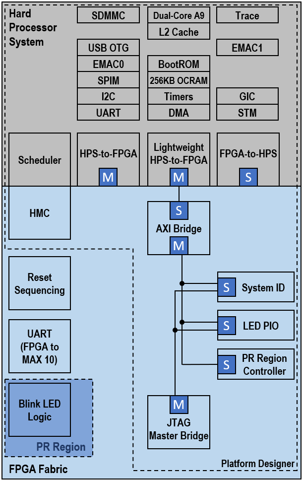

# Hardware

<div class="nav-button-container">
<a href="index.html" class="nav-button">Home</a>
<a href="start-here.html" class="nav-button">Start Here</a>
<span class="nav-button active">Hardware</span>
<a href="software.html" class="nav-button">Software</a>
<a href="program-emmc.html" class="nav-button">Program eMMC</a>
<a href="resources.html" class="nav-button">Resources</a>
</div>

## GHRD Overview
The hardware component, or “Golden Hardware Reference Design” (GHRD), is a complete Quartus reference design targeting the Arria® 10 FPGA. The design includes the Hard Processor Subsystem (HPS) and custom logic running in the FPGA logic fabric. The HPS is configured using the Platform Designer tool in Quartus. After the HPS subsystem is generated, its HDL output is integrated in a top level HDL file that can be modified to include the user’s custom logic. The GHRD is available on the REFLEX CES achilles-hardware github repository page and is automatically downloaded by the build scripts or can be manually cloned (more details below). The achilles-hardware repository branches are named according to the Quartus Prime Pro version tested with that release.

Beginning with the ghrd-v22.1 branch, the GHRD is now generated from TCL scripts. If you want to use the Quartus GUI, you must first generate the design using the scripted flow. Use the GSRD build script (see instructions on the START HERE page) to specify the SOM version and the type of GHRD to build (standard or Partial Reconfiguration reference design).

The latest recommanded branch is ghrd-v23.1 . All versions of the Achilles SOM (V2 & V5) are supported by this branch. While this branch is fully tested with Quartus Prime Pro v23.1, the user has the option to specify a different Quartus version. Only the version specified by any given branch name will be eligible for technical support when working with that branch.

The script-generated Platform Designer .qsys design file enables the following HPS peripherals:

**HPS Hard Peripherals**

- SDMMC
- EMAC1 (RGMII with MDIO)
- EMAC2 (RGMII with MDIO)
- USB1
- I2C0
- UART0
- GPIO (2x in HPS Dedicated I/O block)
- EMIF HPS (DDR4)

**FPGA Soft Peripherals**

- JTAG to Avalon Master Bridge
- PIO
- System ID
- RS232 UART to communicate with MAX 10

The GHRD is based on the Full_Featured.zip design archive available in the latest Achilles board support package Test Design folder. Refer to the README.txt file or the release notes in the header of the top level VHDL file of the GHRD for details of changes made to the Full_Featured design. Below is a block diagram of the GHRD.



There are 2 variations of the GHRD: a standard flat version and a partial reconfiguration version. In both cases, one of the main functions demonstrated is using the HPS to configure the FPGA. This requires the Early I/O Release feature to be enabled in the Quartus project. This feature splits the FPGA configuration sequence into two parts. The first part is the periphery image, which configures the FPGA I/O, Shared I/O, and enables the HPS External Memory Interface (EMIF). The second part is the core image, which configures the FPGA fabric.

In the flat design, there is only the base revision in the Quartus project. After full compilation, this version is used to generate programming files (periph.rbf and core.rbf) for full configuration of the FPGA from U-Boot/SPL. FPGA configuration file updates can be sent to the Achilles SOM remotely, but the entire FPGA needs to be reconfigured by rebooting the system and allowing the SPL and U-Boot to configure the FPGA periphery and core images.

In the partial reconfiguration version, there is a base revision that defines the static region containing design logic that does not change, and the PR region containing logic that can be dynamically reconfigured. Additional revisions are used to define the function of each PR persona. In the GHRD, the PR region contains logic to blink the red LED connected to FPGA user I/O pins. The default configuration will cause the LED to blink once every 0.67 sec. Three additional revisions contain logic to make the LED blink fast, slow, or return to the default blinking rate. This version is used to generate programming files for the static region as well as partial reconfiguration files for each persona. This is a very simplified example used to demonstrate partial reconfiguration controlled by the HPS. Using a standard feature available in the most recent Linux kernels, we can apply a devicetree overlay from Linux to update the PR region with the desired persona configuration file.

So why are there two different versions of the reference design? Due to the architecture of Arria 10 SoC, it is not possible to reconfigure only the core FPGA image from the HPS after the periphery image has been loaded. Only full FPGA reconfiguration is possible, which will reset the FPGA and reconfigure FPGA/HPS shared I/O and DDR memory controllers, causing the HPS to crash. By using partial reconfiguration and the associated Linux drivers available, the HPS can reconfigure only the specified regions of the FPGA while the memory controllers and shared I/O continue to operate. If you only need the HPS to configure the FPGA at power up and can tolerate down time for future upgrades, then you can use a standard flat design without specifying PR regions. Otherwise, if you need to support FPGA configuration file updates through Linux without rebooting your system, then you will need to implement PR regions in your design. Refer to the documentation links provided on the RESOURCES page for implementing the PR flow in your design.

The image below describes the new GHRD build flow starting with the ghrd-v22.1 branch:

   1. The primary TCL script is **achilles_ghrd_build_flow.tcl** and is launched with the quartus_sh -t command from the **achilles-ghrd-build.sh** script.
   2. The **achilles_ghrd_build_flow.tcl** script then sources **create_achilles_ghrd_project.tcl**.
   3. Process are run within **create_achilles_ghrd_project.tcl** to create the the Quaruts project and make project assignments for the user specified SOM and GHRD
   4. Another process generates the **achilles_qsys_script_GENERATED.tcl**.
   5. If the user chose the Partial Reconfiguration GHRD, the PR revisions are created.
   6. The generated script then creates the Platform Designer .qsys file, instantiates the HPS and peripheral IP, and sets their configuration parameters.
   7. After the Platform Designer .qsys file and IP files are created, the Platform Designer system is generated.
   8. When this completes, the full Quartus compilation flow begins.
   9. Finally, after compilation finishes, the resulting .sof file is converted to the split *.periph.rbf* and *.core.rbf* configuration files which are used by the HPS to configure the FPGA.


Suggested Quartus Hardware reference designs available for Achilles SOM:

| Design            | Description                                                | Quartus Version   | Location                                                          | Branch        |
|-------------------|------------------------------------------------------------|-------------------|-------------------------------------------------------------------|---------------|
| Full_Featured.zip | official REFLEX CES Achilles SOM HPS/FPGA reference design | v18.1.0 Pro       | Achilles BSP "Test Design" folder                                 | N/A           |
| achilles_ghrd     | HPS/FPGA reference design - flat design hierarchy          | v20.1.0 Pro       | https://github.com/reflexces/achilles-hardware/tree/ghrd-v20.1    | ghrd-v20.1    |
| achilles_ghrd     | HPS/FPGA reference design - Partial Reconfiguration        | v20.1.0 Pro       | https://github.com/reflexces/achilles-hardware/tree/ghrd-v20.1-pr | ghrd-v20.1-pr |
| achilles_ghrd     | HPS/FPGA reference design - Partial Reconfiguration        | v21.1.0 Pro       | https://github.com/reflexces/achilles-hardware/tree/ghrd-v21.1-pr | ghrd-v21.1-pr |
| achilles_ghrd     | HPS/FPGA reference design - Partial Reconfiguration        | v21.3.0 Pro       | https://github.com/reflexces/achilles-hardware/tree/ghrd-v21.3-pr | ghrd-v21.3-pr |
| achilles_ghrd     | HPS/FPGA reference design - standard or PR example         | v22.1.0 Pro       | https://github.com/reflexces/achilles-hardware/tree/ghrd-v22.1    | ghrd-v22.1    |
| achilles_ghrd     | HPS/FPGA reference design - standard or PR example         | v23.1.0 Pro       | https://github.com/reflexces/achilles-hardware/tree/ghrd-v23.1    | ghrd-v23.1    |

**Directory structure of the GHRD (ghrd-v21.3 and older)**
```bash
📁  achilles-hardware
├── 📁 devicetree (contains devicetree overlay source files and pre-compiled dtbo binaries used for configuring the PR region; explained in more detail on the **Software** page)
├── 📁 hps_isw_handoff (contains the software handoff files generated during compilation)
├── 📁 output_files (contains the programming files generated during compilation; fetched during software build and included on eMMC image file)
└── 📁 src (main source file directory)
    └── 📁 ip (contains Platform Designer source files)
```

**Directory structure of the GHRD (ghrd-v22.1 and newer)**
```bash
📁 achilles-hardware
├── 📁 precompiled
|   ├── 📁 hps_isw_handoff (contains precompiled software handoff files for each SOM version, generated during compilation)
|   └── 📁 rbf (contains precompiled FPGA configuration files for each SOM version; fetched during software build and included on eMMC image file)
└── 📁 src
    ├── 📁 hdl (contains VHDL source files)
    └── 📁 script (contains Platform Designing source script files
```

### Compiling the GHRD (ghrd-v22.1 and newer)
For the best user experience, it is recommended to use the GSRD build script described on the **Start Here** page.

Advanced users may choose to run the **achilles-ghrd-build.sh** script separately by following these instructions.

1. Open a terminal console and create a working directory for the build:

    ```bash
    mkdir achilles-ghrd-2023.07
    cd achilles-ghrd-2023.07
    ```

2. Download and run the Achilles !GHRD Build Script.  Running the script without any arguments will display the usage instructions.  The !SOM version and GHRD type are the minimum required arguments for the script.  The example below will build the Partial Reconfiguration GHRD for the v5 Indus !SOM: 

    ```bash
    wget https://raw.githubusercontent.com/reflexces/build-scripts/2023.07/achilles-ghrd-build.sh
    chmod +x achilles-ghrd-build.sh
    ./achilles-ghrd-build.sh -s v5-indus -g pr
    ```

### Compiling the GHRD (ghrd-v21.3 and older)
Detailed instructions for compiling the !GHRD are not provided here.  It is assumed that the user has sufficient knowledge of FPGA design and the Quartus development tools GUI to open a project and start the compilation process.  This can be done on either a Windows or Linux system using the Quartus GUI (command line build scripts are not provided).  The software build described on the **Software** page **must** be done on Linux.  It will simplify the process to work completely in Linux if possible, since you will not need to transfer files from Windows to Linux when moving on to the Software build stage.  To use the !GHRD as a starting point for your own design or to recompile it, download the ZIP archive using the github link above, or using **git** to clone the repository and checkout the desired branch:

```bash
git clone https://github.com/reflexces/achilles-hardware.git
cd achilles-hardware
git checkout ghrd-v21.3
#OR
git checkout ghrd-v21.3-pr
```

Open the Quartus project and start a full compilation.  If using the Partial Reconfiguration GHRD, remember to run a full compilation for each design revision persona after compiling the base revision.


Refer to the Partial Reconfiguration documentation listed on the **Resources** page for more information on the Partial Reconfiguration design flow.  After the Quartus project compilation successfully completes, you will find the required software handoff files in the *hps_isw_handoff* folder and the FPGA programming files in the **output_files** folder of the Quartus project directory.  Pre-compiled FPGA configuration files (.sof/.rbf) are provided with the !GHRD in the github repository and are fetched and included in the generated eMMC image during the software build stage.  If the !GHRD was modified, then you will need to convert the generated achilles_ghrd.sof (or your_project.sof) file to split .rbf files (peripheral and core images).  Do this by opening a command line terminal on your host build machine (Windows or Linux), browse to your project **output_files** directory, and run the following command:

```bash
quartus_cpf --convert --hps -o bitstream_compression=on achilles_ghrd.sof achilles_ghrd.rbf
```

Note: To run the quartus_cpf command, it may be necessary to specify the full path to your quartus/bin64 installation directory if not already set in your environment PATH variable (e.g. ~/intelFPGA_pro/20.1/quartus/bin64/quartus_cpf ...).

<font color="red">Warning: The .periph.rbf and .core.rbf configuration files must come from the same Quartus project and version. Attempting to mix configuration files from different projects or compilations will result in FPGA configuration failure.</font>

The above step is the same for both the flat and PR versions of the GHRD.  In the PR version, run this above command using the base revision .sof file (achilles_ghrd.sof) to generate the split .rbf files.  For each of the PR region persona revisions, there is a setting enabled in each of the corresponding .qsf files that generates the PR region .rbf files during compilation:

```bash
set_global_assignment -name GENERATE_PR_RBF_FILE ON
```

Without this .qsf setting, you would have to run a similar **quartus_cpf** command to convert the partial-mask file for the PR region for each persona revision in your design, for example:

```bash
quartus_cpf --convert blink_led_fast.pr_partition.pmsf blink_led_fast.pr_partition.rbf
```

These PR region .rbf files must be copied to the Achilles Linux root filesystem (**/lib/firmware** is default) and are then referenced in a devicetree overlay file and applied to the base devicetree that is loaded with the Linux kernel during the boot process.  The devicetree overlay process is described in more detail on the **Software** page.  The .rbf and devicetree overlay files are automatically copied to the generated root filesystem based on instructions in the **achilles-firmware.bb** recipe during the scripted build flow on the **Software** page.  If using your own .rbf files generated from your project, you must ensure that they are copied correctly to the root filesystem if not using the scripted flow.

There is one additional step we need to manually perform to convert the periph.rbf and core.rbf files to the FIT image format used by U-Boot.  This is explained on the **Software** page under the **Option 2: Generate FIT Images** section.

### Preparing for Software Handoff
<!--The following steps are only required if you are bringing your own Quartus design or making changes to the !GHRD HPS system.  The Achilles U-Boot patch available in the *meta-achilles* Yocto BSP layer provided with this example already contains a functional U-Boot devicetree generated from this !GHRD with the peripherals described above.  If you only want to rebuild the software components, proceed to the *Software* page now.
-->
If working in Windows to compile the FPGA design and transitioning to Linux at this time, open a terminal and create a top level working directory on your Linux host build system:

```bash
mkdir -p ~/achilles && cd ~/achilles
```

Make a copy of the **hps_isw_handoff** folder to this working directory.  If you are already working in Linux at this time, you can work with the existing directory on your Linux PC.  You should have the following files in the **hps_isw_handoff** folder:

```bash
📁 achilles
└── 📁 hps_isw_handoff
    ├── emif.xml
    ├── hps.xml
    └── id
```
<!--
Start an Embedded Command Shell (default Quartus installation path is assumed):

```bash
~/intelFPGA_pro/20.1/embedded/embedded_command_shell.sh
```

Browse to the directory containing the *hps_isw_handoff* folder, but do not push into that folder - stay one level above.  This would be your Quartus project root folder (*achilles-hardware* if you cloned from github, or the *achilles* directory if created in the step above).

Convert the handoff data into a U-Boot devicetree:

```bash
bsp-create-settings --type uboot --bsp-dir software/bootloader --preloader-settings-dir "hps_isw_handoff" --settings software/bootloader/settings.bsp
```

This will create the file **/software/bootloader/devicetree.dts**.  This file must be manually modified and copied into the U-Boot source tree (arch/arm/dts) after cloning the **u-boot-socfpga** Github repository and applying the [Achilles u-boot patch](https://github.com/reflexces/meta-achilles/blob/warrior/recipes-bsp/u-boot/files/v2019.10/0001-add-achilles-support-for-u-boot-socfpga-v2019.10.patch).  For details on the required modifications to **devicetree.dts**, refer to the [Building Bootloader](https://rocketboards.org/foswiki/Documentation/BuildingBootloader#Arria_10_SoC_45_Boot_from_SD_Card) article.  Again, this step is not required if you are simply rebuilding the !GHRD, since this file is already provided in the github repository.
-->

Now you are ready to move on to building the **Software** components.

<div class="nav-button-container">
<a href="index.html" class="nav-button">Home</a>
<a href="start-here.html" class="nav-button">Start Here</a>
<span class="nav-button active">Hardware</span>
<a href="software.html" class="nav-button">Software</a>
<a href="program-emmc.html" class="nav-button">Program eMMC</a>
<a href="resources.html" class="nav-button">Resources</a>
</div>
