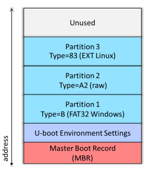
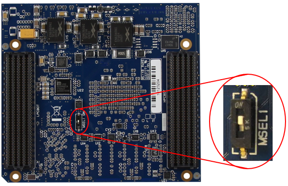

# Program eMMC

The scripted Yocto build process will generate a WIC image file with the partition layout as shown in the image below.



A script is available to make the eMMC programming process easier.  The script can be run as part of the full GSRD build process by running the GSRD build script (see the **START HERE** page), or it can run independently.  This script can run in Linux or Windows (using Nios II Command Shell or WSL shell).  To manually download and run the script:

```bash
wget https://raw.githubusercontent.com/reflexces/build-scripts/2023.07/program-emmc.sh
chmod +x program-emmc.sh
./program-emmc.sh
```

The table below summarizes the files included in the WIC image and how each file is generated. The latest released version of each of these files can be downloaded from the [meta-achilles github release page](https://github.com/reflexces/meta-achilles/releases/tag/kirkstone-2023.07)

| File Name                        | Description                   | Partition          | Source of File                       |
|----------------------------------|-------------------------------|--------------------|--------------------------------------|
| achilles-console...rootfs.tar.gz | Poky root filesystem          | Partition 3 (EXT4) | Yocto build                          |
| u-boot-splx4.sfp                 | SPL image with devicetree     | Partition 2 (A2)   | Yocto build or U-Boot make           |
| socfpga_arria10_achilles.dtb     | Devicetree binary             | Partition 1 (FAT)  | Yocto build or dtbs make             |
| achilles_ghrd.core.rbf           | FPGA core configuration file  | Partition 1 (FAT)  | quartus_cpf after Quartus GHRD build | 
| fit_spl_fpga_periph_only.itb     | FPGA periphery FIT image      | Partition 1 (FAT)  | U-Boot mkimage                       |
| fit_spl_fpga.itb                 | FPGA core FIT image           | Partition 1 (FAT)  | U-Boot mkimage                       |
| zImage                           | compressed Linux kernel image | Partition 1 (FAT)  | Yocto build or kernel make           | 
| u-boot.img                       | U-Boot binary image           | Partition 1 (FAT)  | Yocto build or U-Boot make           |
| extlinux/extlinux.conf           | boot configuration file       | Partition 1 (FAT)  | Yocto build (achilles.conf)          |

The precompiled WIC image can be downloaded from here, or they can be downloaded automatically by using the programming script:

##### Older releases for Turbo SOM

| File Name | Release | md5sum |
|-----------|---------|--------|
| [achilles-console-image-achilles.wic](https://github.com/reflexces/meta-achilles/releases/download/v1.0/achilles-console-image-achilles.wic) | v1.0 | 50b0461de133ac014e1280eede02550e |
| [achilles-console-image-achilles.wic](https://github.com/reflexces/meta-achilles/releases/download/v2021.08/achilles-console-image-achilles.wic) | v2021.08 | 768cc168c3749e556b43ae7a05577769 |
| [achilles-console-image-achilles.wic](https://github.com/reflexces/meta-achilles/releases/download/v2021.12/achilles-console-image-achilles.wic) | v2021.12 | d30dc277e67ad4ee68b9bd14b2b606b1 |

##### Older releases for V2 SOM versions

| File Name | Release | md5sum |
|---|---------|--------|
| [achilles-console-image-achilles-turbo.wic](https://github.com/reflexces/meta-achilles/releases/download/v2022.06/achilles-console-image-achilles-turbo.wic) | v2022.06 | fe1a5445808a1029574eca0b013a0032 |
| [achilles-console-image-achilles-indus.wic](https://github.com/reflexces/meta-achilles/releases/download/v2022.06/achilles-console-image-achilles-indus.wic) | v2022.06 | 420b95936f74404c27a7a457b268fe40 |
| [achilles-console-image-achilles-lite.wic](https://github.com/reflexces/meta-achilles/releases/download/v2022.06/achilles-console-image-achilles-lite.wic) | v2022.06 | d7d63cb45205b522050c4b3f04ba2b7d |

##### Latest releases for all SOM versions

| File Name | Release | md5sum |
|-----------|---------|--------|
| [achilles-console-image-achilles-v2-indus.wic](https://github.com/reflexces/meta-achilles/releases/download/kirkstone-2023.07/achilles-console-image-achilles-v2-indus.wic) | kirkstone-2023.07 | 39bf9e40d72f77f59d3df6ac46fb2cea |
| [achilles-console-image-achilles-v2-lite.wic](https://github.com/reflexces/meta-achilles/releases/download/kirkstone-2023.07/achilles-console-image-achilles-v2-lite.wic) | kirkstone-2023.07 | e7cc780645b5ae2332e56fedd92e4489 |
| [achilles-console-image-achilles-v2-turbo.wic](https://github.com/reflexces/meta-achilles/releases/download/kirkstone-2023.07/achilles-console-image-achilles-v2-turbo.wic) | kirkstone-2023.07 | ea4766829dce6c8853916aefee9086a3 |
| [achilles-console-image-achilles-v5-indus.wic](https://github.com/reflexces/meta-achilles/releases/download/kirkstone-2023.07/achilles-console-image-achilles-v5-indus.wic) | kirkstone-2023.07 | 35d28b87edadb77083c74f1220ab2680 |
| [achilles-console-image-achilles-v5-lite.wic](https://github.com/reflexces/meta-achilles/releases/download/kirkstone-2023.07/achilles-console-image-achilles-v5-lite.wic) | kirkstone-2023.07 | 3b4b9867ca9d1fec690dd1486f4b845d |

### Prerequisites for Programming eMMC

**Note:** when using the eMMC Programming script, you must still setup a TFTP server and complete Steps 1 - 3 below.  The remaining steps are done automatically by the programming script.

In order to write a full eMMC image or update any partition of the eMMC, it is necessary to setup a TFTP server and boot the Achilles SOM from the network instead of booting from the eMMC.  This is necessary in most cases (especially for full WIC image programming) because we don't want to modify a live mounted eMMC that we just booted from.  Booting an initramfs from TFTP leaves the eMMC unmounted and safe to modify.  REFLEX CES provides the example design **RefDesign_HPS_boot_from_FPGA** in the Achilles board support package that faciltates this process.  You can configure the Arria® 10 FPGA with the .sof image that contains U-Boot running from FPGA on-chip RAM, which then boots the initramfs image containing the Linux kernel and minimal root filesystem running from RAM.  Once fully booted, you can then use standard Linux commands to program the eMMC.  It is not necessary to recompile this reference design in Quartus.  Downloading and configuring the FPGA with this design is done automatically by the programming script.

<!--  THIS IS NOW HANDLED BY THE PROGRAMMING SCRIPT
The precompiled binaries for **RefDesign_HPS_boot_from_FPGA** can be download from here:

| File Name                        | Description                       | md5sum                            |
|----------------------------------|-----------------------------------|-----------------------------------|
| RefDesign_HPS_boot_from_FPGA.sof | SOF programming file              | 2c20cb12f0cc71957f7a5e69b3f36076  |
| linuxDT.dtb                      | Linux devicetree binary           | 4b7301146c1f148006440f7f63c2399b  |
| zImage                           | Linux kernel image with initramfs | 957e27a44e286975ad674f9545106fc8  |
| [[https://github.com/reflexces/meta-achilles/releases/download/v1.0/tftp-recovery-files.tar.gz][tftp-recovery-files.tar.gz]] | archive of all 3 files above   | 3e6352ae6a6721794cfceb91573ceba9 |
-->

The zImage Linux kernel with embedded initramfs can be downloaded from the links in the table or by using the command line examples below:

| SOM Version | File Name | Description                     | md5sum                          |
|-------------|-----------|---------------------------------|---------------------------------|
| V2 Turbo    | [linuxDT.dtb](https://raw.githubusercontent.com/reflexces/build-scripts/2023.07/prog-files/tftp-boot-files/SomA10-V2/Turbo/linuxDT.dtb) | Linux devicetree binary           | 4b7301146c1f148006440f7f63c2399b |
|             | [zImage](https://raw.githubusercontent.com/reflexces/build-scripts/2023.07/prog-files/tftp-boot-files/SomA10-V2/Turbo/zImage)       | Linux kernel image with initramfs | 957e27a44e286975ad674f9545106fc8 |
| V2 Indus    | [linuxDT.dtb](https://raw.githubusercontent.com/reflexces/build-scripts/2023.07/prog-files/tftp-boot-files/SomA10-V2/Indus/linuxDT.dtb) | Linux devicetree binary           | 93d9b250c05ec63930ee4f2f2a967af2 |
|             | [zImage](https://raw.githubusercontent.com/reflexces/build-scripts/2023.07/prog-files/tftp-boot-files/SomA10-V2/Indus/zImage)       | Linux kernel image with initramfs | 1a43531bb37d4d421d5016c5e1c52879 |
| V2 Lite     | [linuxDT.dtb](https://raw.githubusercontent.com/reflexces/build-scripts/2023.07/prog-files/tftp-boot-files/SomA10-V2/Lite/linuxDT.dtb) | Linux devicetree binary           | ea379d51668c5a5574a5a8603dbac9b6 |
|             | [zImage](https://raw.githubusercontent.com/reflexces/build-scripts/2023.07/prog-files/tftp-boot-files/SomA10-V2/Lite/zImage)       | Linux kernel image with initramfs | 5b3e731a57cbeca4340f149f7a3e7ca4 |
| V5 Indus    | [linuxDT.dtb](https://raw.githubusercontent.com/reflexces/build-scripts/2023.07/prog-files/tftp-boot-files/SomA10-V5/Indus/linuxDT.dtb) | Linux devicetree binary           | d9ad385183620563336a89ae94a7a4e0 |
|             | [zImage](https://raw.githubusercontent.com/reflexces/build-scripts/2023.07/prog-files/tftp-boot-files/SomA10-V5/Indus/zImage)       | Linux kernel image with initramfs | 9bef9b5987012f0562103117792052f2 |
| V5 Lite     | [linuxDT.dtb](https://raw.githubusercontent.com/reflexces/build-scripts/2023.07/prog-files/tftp-boot-files/SomA10-V5/Lite/linuxDT.dtb) | Linux devicetree binary           | 865f7c055a575bc8422f2c24ad0cbe50 |
|             | [zImage](https://raw.githubusercontent.com/reflexces/build-scripts/2023.07/prog-files/tftp-boot-files/SomA10-V5/Lite/zImage)       | Linux kernel image with initramfs | efdf57b80dd2185cc520ba43eb3580b5 |

For V2 Turbo SOM:

```bash
wget https://raw.githubusercontent.com/reflexces/build-scripts/2023.07/prog-files/tftp-boot-files/SomA10-V2/Turbo/linuxDT.dtb
wget https://raw.githubusercontent.com/reflexces/build-scripts/2023.07/prog-files/tftp-boot-files/SomA10-V2/Turbo/zImage
```

For V2 Indus SOM:

```bash
wget https://raw.githubusercontent.com/reflexces/build-scripts/2023.07/prog-files/tftp-boot-files/SomA10-V2/Indus/linuxDT.dtb
wget https://raw.githubusercontent.com/reflexces/build-scripts/2023.07/prog-files/tftp-boot-files/SomA10-V2/Indus/zImage
```

For V2 Lite SOM:

```bash
wget https://raw.githubusercontent.com/reflexces/build-scripts/2023.07/prog-files/tftp-boot-files/SomA10-V2/Lite/linuxDT.dtb
wget https://raw.githubusercontent.com/reflexces/build-scripts/2023.07/prog-files/tftp-boot-files/SomA10-V2/Lite/zImage
```

For V5 Indus SOM:

```bash
wget https://raw.githubusercontent.com/reflexces/build-scripts/2023.07/prog-files/tftp-boot-files/SomA10-V5/Indus/linuxDT.dtb
wget https://raw.githubusercontent.com/reflexces/build-scripts/2023.07/prog-files/tftp-boot-files/SomA10-V5/Indus/zImage
```

For V5 Lite SOM:
```bash
wget https://raw.githubusercontent.com/reflexces/build-scripts/2023.07/prog-files/tftp-boot-files/SomA10-V5/Lite/linuxDT.dtb
wget https://raw.githubusercontent.com/reflexces/build-scripts/2023.07/prog-files/tftp-boot-files/SomA10-V5/Lite/zImage
```

Whether you already have a TFTP server setup, or you need to [Booting Altera SoC FPGA From Network Using TFTP And NFS](https://www.rocketboards.org/foswiki/Documentation/BootingAlteraSoCFPGAFromNetworkUsingTFTPAndNFS), it is necessary to change or set some parameters to match the expected values specified in the U-Boot environment variables used in the  “RefDesign_HPS_boot_from_FPGA” reference design.  The default U-Boot environment values are summarized in the table below.  Refer to the Achilles Reference Manual "HPS Development" chapter for addtional details.

| TFTP Server Parameter                   | u-boot env variable setting    |
|-----------------------------------------|--------------------------------|
| server IP address (v2): 192.168.1.200   | serverip=192.168.1.200         |
| server path: SomA10-V2/Turbo/           | tftppath=SomA10-V2/Turbo/      |
| server path: SomA10-V2/Indus/           | tftppath=SomA10-V2/Indus/      |
| server path: SomA10-V2/Lite/            | tftppath=SomA10-V2/Lite/       |
| server IP address (v5): 192.168.200.200 | serverip=192.168.200.200       |
| server path: SomA10-V5/Indus/           | tftppath=SomA10-V5/Indus/      |
| server path: SomA10-V5/Lite/            | tftppath=SomA10-V5/Lite/       |

These files must be located in the TFTP server path specified in the **tftppath** variable (see download information above):

| File Name       | u-boot env variable setting    |
|-----------------|--------------------------------|
| linuxDT.dtb     | fdtfile=linuxDT.dtb            |
| zImage          | bootimage=zImage               |

With a network managed by a DHCP server, interrupt the boot process in U-Boot and modify some U-Boot environment variables with the commands:

```bash
setenv serverip <tftp-server-ip-addr>
setenv rxcethboot "setenv bootargs console=ttyS0,115200 ip=dhcp ; bootz ${loadaddr} - ${fdtaddr}"
setenv rxcethload "dhcp ; tftp ${loadaddr} ${tftppath}${bootimage} ; tftp ${fdtaddr} ${tftppath}${fdtimage} ;"
# Restart the boot process
run bootcmd
```

On a network without a DHCP server, interrupt the boot process in U-Boot and modify some U-Boot environment variables with the commands:

```bash
setenv ipaddr <board-ip-addr>
setenv serverip <tftp-server-ip-addr>
setenv rxcethboot "setenv bootargs console=ttyS0,115200 ip=none ; bootz ${loadaddr} - ${fdtaddr}"
setenv rxcethload "tftp ${loadaddr} ${tftppath}${bootimage} ; tftp ${fdtaddr} ${tftppath}${fdtimage} ;"
# Restart the boot process
run bootcmd
```

After changing the variables, you can make them permanent by using the =saveenv= command before restarting the boot process by using the =run bootcmd= comand.

### Writing Full WIC Image to eMMC
Once the TFTP server is setup, you can perform a network boot and program the Achilles eMMC by following these steps.  Some knowledge of connecting to the Achilles SOM usinng terminal emulator software (e.g. PuTTY, Minicom, etc) and use of the Quartus Programmer is assumed for these steps.  Refer to the Achilles Reference Manual if you need assistance.

#### Boot the initramfs Image
1. With the Achilles SOM and carrier board powered off, carefully remove the SOM from the carrier board and move the MSEL1 switch on the reverse side of the board to the ON position as shown in the image below.  This will enable the FPP x32 configuration mode of the Arria® 10 FPGA, as required for the HPS to configure the FPGA.

    

2. Plug the SOM back into the carrier board.  Plug in a microUSB cable between the host PC and the microUSB connector on the carrier board labeled “BLASTER”.  Plug in an Ethernet cable between your network router and the RJ-45 Ethernet port labeled “ETH1”.  Verify that the BSEL pins are set as shown in the image below (0x5) to enable boot from 3.0V SD/MMC flash.  
%IMAGE{"som-carrier.png" height="400"}%

3. Open your preferred terminal emulator software.  Power on the board and establish a connection between the board and the terminal emulator.  If using the Achilles SOM in factory condition, you should not see any output on the terminal at this time because the new MSEL switch position will prevent FPGA configuration in AS mode.  If you have already programmed the eMMC with this example image and U-Boot loads the FPGA core.rbf file, you will need to interrupt the boot process at U-Boot to prevent core.rbf programming.  Otherwise, the Quartus programmer will fail in the next step.

4. Open the Quartus Programmer tool and click the “Hardware Setup” button and establish a connection to the Achilles SOM (“Arria10 IDK”).  Auto detect the JTAG chain and accept all detected device defaults.  Click to select the Arria® 10 device in the list and click "Add File" to add a programming file.  Browse to the location of the .sof file downloaded from the link above and select it.  If a second Arria® 10 device appears in the list below the one with the file just added, then delete it.  Check the “Program/Configure” box, and click "Start" to program the FPGA.  Once programming completes, you should start to see output to the serial terminal.

#### Option 1: Program the eMMC (through USB key)

1. Copy the Yocto generated WIC image on a USB key and plug the USB key in the USB OTG port of the Carrier Board.

    **NOTE:** The USB adapter must be On-The-Go compliant.

2. On Achilles SOM serial terminal emulator session, mount the USB key partition.

    ```bash
    mkdir -p /mnt/key
    mount -o ro /dev/sda1 /mnt/key
    ```

3. On Achilles SOM serial terminal emulator session, clone the image file to the eMMC. There is no need to mount the eMMC device first to clone the full image.

    ```bash
    dd if=/mnt/key/achilles-console-image-achilles-v5-indus.wic of=/dev/mmcblk0 && sync
    ```

4. After the cloning process is complete, shut down the initramfs session on Achilles:

    ```bash
    poweroff
    ```

5. Power cycle the Achilles board.  Do not just issue a **reboot** command from the Linux command prompt; you must power cycle the board after the **dd** process completes.  You should now observe the boot process in your terminal emulator.  First, the FPGA periphery image is loaded by the SPL.  The SPL then loads the u-boot.img file from the FAT partition and U-Boot starts.  The FPGA core image is then programmed by U-Boot and then the Linux kernel, devicetree, and root filesystem are loaded.  You should finally arrive at the Poky linux prompt.

#### Option 2: Program the eMMC (through Ethernet)

1. If the board is connected on a network with a DHCP server, find the IP address assigned to the board.  Otherwise, set a static IP address to the board.

    Get Ethernet IP addresses on Achilles SOM via serial terminal emulator:

    ```bash
    ip address show up
    ```

    If needed, set eth0 static IP address on Achilles SOM via serial terminal emulator:

    ```bash
    ip link set eth0 up
    ip address add 192.168.200.42/24 dev eth0
    ```

2. To copy the Yocto generated WIC image to the Achilles eMMC, open a terminal window on your Linux host and browse to the directory containing the WIC image.

3. Copy the WIC image to the initramfs session running on the Achilles SOM:

    ```bash
    scp achilles-console-image-achilles-v5-indus.wic root@<board-ip-addr>:/
    ```

    Be sure to enter the correct IP address for the Achilles board that you noted in step 6.a above.
    Type **yes** to accept the connection and then enter the Achilles initramfs password **root**.
    The file will take about 2 minutes to transfer.

4. After the transfer is complete, go back to the Achilles serial terminal emulator session and clone the image file to the eMMC. There is no need to mount the eMMC device first to clone the full image.

    ```bash
    dd if=achilles-console-image-achilles-v5-indus.wic of=/dev/mmcblk0 && sync
    ```

5. Continue at the step 5.d in the previous chapter.

### Updating Individual eMMC Partitions
If you want to update individual files on any of the partitions, follow the steps above to load the initramfs image over your network.  Then copy the files you want to update to the corresponding Achilles eMMC partition.  Note that you can update individual eMMC partitions on the REFLEX CES factory default eMMC layout with the binary files provided here, but you will need to update several U-Boot environment variables to point to the correct FAT partition.

Mount the partition you want to update:

#### Partition 1 (FAT)
On Achilles SOM via serial terminal emulator:

```bash
mkdir -p /media/emmcp1; mount -t vfat /dev/mmcblk0p1 /media/emmcp1; cd /media/emmcp1
```

On Linux host, copy files to the mounted partition:

```bash
scp <filename> root@<board-ip-addr>:/media/emmcp1
```

#### Partition 2 (A2)
It is not necessary to mount the raw A2 partition to update it with a new U-Boot/SPL image:
On Linux host, copy files to root (/) on the initramfs session:
```bash
scp <u-boot-spl-image-name> root@<board-ip-addr>:/
```

On Achilles SOM via serial terminal emulator:

```bash
dd if=<u-boot-spl-image-name> of=/dev/mmcblk0p2 && sync
```

#### Partition 3 (EXT4)
**NOTE:** This step is only required if you booted from the initramfs and the eMMC is not mounted.  If booting to Poky Linux from eMMC, it is not necessary to mount this partition since it is already mounted.
On Achilles SOM via serial terminal emulator:

```bash
mkdir -p /media/emmcp3; mount -t ext4 /dev/mmcblk0p3 /media/emmcp3; cd /media/emmcp3
```

On Linux host, copy files to the mounted partition:

```bash
scp <rootfs_archive.tar.xz> root@<board-ip-addr>:/media/emmcp3
```
or

```bash
scp <new_fpga_prog_file.rbf> root@<board-ip-addr>:/lib/firmware
```

When file copying is complete, shut down the initramfs session on Achilles:

```bash
poweroff
```

Power cycle the Achilles board.

### Creating Your Own eMMC Image
If you built the individual hardware and software system components and want to create your own eMMC image, you can follow the example available on the [Building Bootloader](https://rocketboards.org/foswiki/Documentation/BuildingBootloaderCycloneVAndArria10#Arria_10_SoC_45_Boot_from_SD_Card) article page.  Scroll down to section **C. Build SD Card Image**.  Then follow the steps above to clone the image to the Achilles eMMC.
