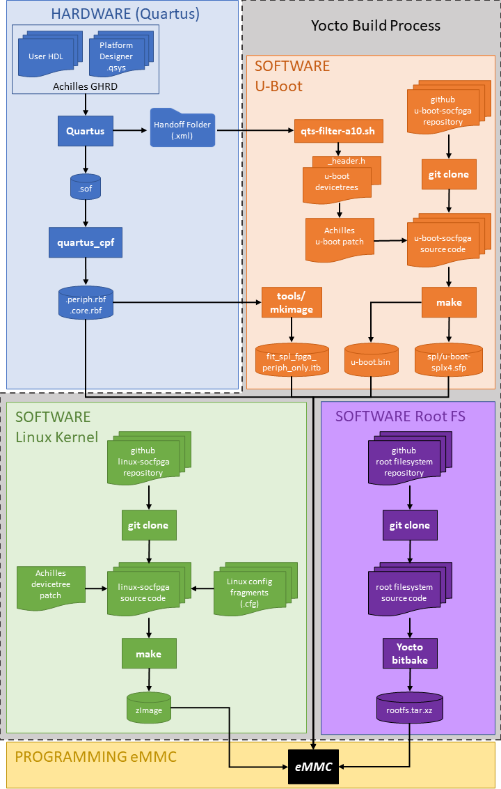
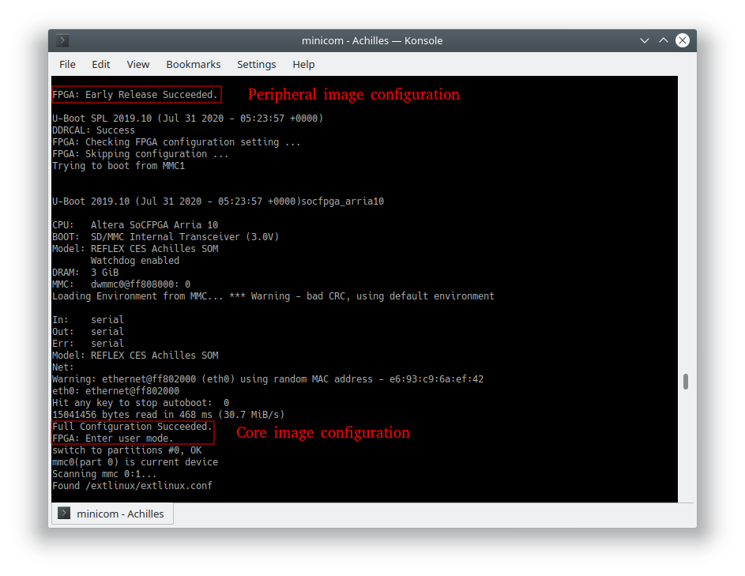
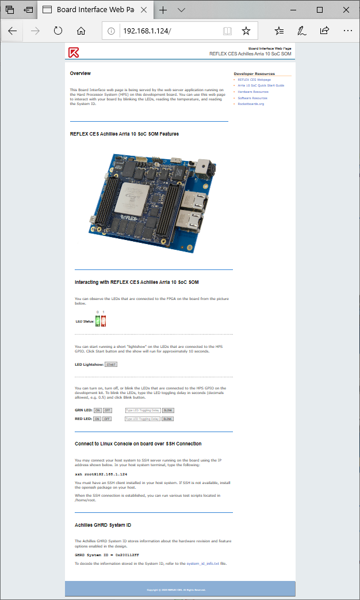
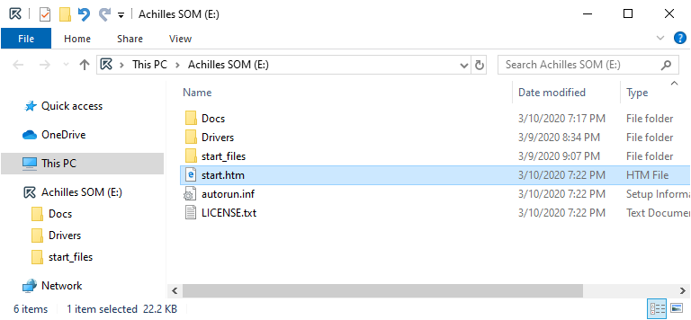
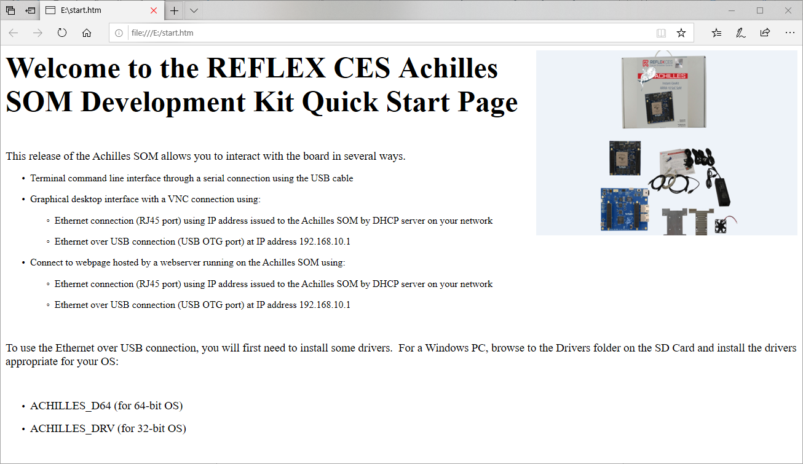

# Start Here

<div align="center">

| [Overview](../README.md) | Start Here | [Hardware](hardware.md) | [Software](software.md) | [Program eMMC](program-emmc.md) | [Resources](resources.md) |
|:------------------------:|:----------:|:-----------------------:|:-----------------------:|:-------------------------------:|:-------------------------:|

</div>

## Achilles GSRD Overview

The GSRD (Golden System Reference Design) example presented here for the Achilles SOM consists of a Hardware component and a Software component.  The GSRD demonstrates the following features:
- Quartus Prime Pro FPGA reference design with HPS system configuring the available hardware peripherals on Achilles SOM and Starter carrier board
- Generation of HPS software components required to boot to Linux
  - SPL/U-Boot
  - Linux kernel
  - Achilles devicetree binary
  - Root filesystem
- FPGA configuration from HPS:
  - From SPL/U-Boot (peripheral image only)
  - From U-Boot proper (core image only)
- Application of devicetree overlay
   - FPGA partial reconfiguration from Linux
   - Dynamically update devicetree with new peripherals
- Web server
- USB gadget support
   - Achilles SOM appears as mass storage device
   - Ethernet over USB

##### GSRD version history and release table
| GSRD Version   | Release Date     | GHRD Quartus Version | meta-achilles branch | U-Boot Version | Kernel Version  | Root Filesystem Version     |
|----------------|------------------|----------------------|----------------------|----------------|-----------------|-----------------------------|
| v1.0           | May 2020         | v20.1                | warrior              | v2019.10       | 4.14.130-ltsi   | Angstrom v2019.06-warrior   |
| v2021.08       | August 2021      | v21.1                | gatesgarth           | v2021.01       | 5.4.104-lts     | Yocto Poky gatesgarth 3.2.4 |
| v2021.12       | December 2021    | v21.3                | honister             | v2021.07       | 5.10.60-lts     | Yocto Poky honister 3.4.1   |
| v2022.06       | June 2022        | v22.1*               | kirkstone            | v2021.07       | 5.10.100-lts    | Yocto Poky kirkstone 4.0.1  |
| v2023.07       | June 2023        | v23.1*               | kirkstone            | v2021.07       | 5.10.100-lts    | Yocto Poky kirkstone 4.0.8  |

### Getting Started

The 2022.06 GSRD release introduces a new and more user-friendly script (reflex-gsrd-build.sh) to complete all of the GSRD build tasks.  The three main tasks, which correspond to the Tabs at the top of this page, are:

1. Build the FPGA reference design - **HARDWARE**
2. Build the HPS software components using the Yocto project tool flow - **SOFTWARE**
3. Program the eMMC flash on the SOM using the generated WIC image from step 2. - **PROGRAM EMMC**

The script uses a series of menus to choose the build task(s) to run, apply the required settings for each task, and then begin processing those tasks.  For the best user experience, it is recommended to use the GSRD build script.  Advanced users may choose to run the individual build steps on each subsequent page.  From this *START HERE* page, follow these instructions to launch the full GSRD build script:

1. Open a terminal console and create a working directory for the build:

```bash
mkdir achilles-gsrd-2023.07
cd achilles-gsrd-2023.07
```

2. Install required packages (most are used by Yocto but some are used by other build tasks).  Note that this is the only script that should be run with the *sudo* command:

```bash
wget https://raw.githubusercontent.com/reflexces/build-scripts/2023.07/yocto-packages.sh
chmod +x yocto-packages.sh
sudo ./yocto-packages.sh
```

3. Download and run the GSRD Build Script: 

```bash
wget https://raw.githubusercontent.com/reflexces/build-scripts/2023.07/reflex-gsrd-build.sh
chmod +x reflex-gsrd-build.sh
./reflex-gsrd-build.sh
```

Then follow the on-screen instructions to continue.

The diagram below summarizes the Achilles GSRD Hardware and Software design flows.  Each color-coded section corresponds to a tab (or button) at the top of this page where you will find instructions for each step in the process.  The Yocto build process can perform multiple steps of the build process (U-Boot, Linux kernel, and root filesystem) to generate a single bootable image file for the Achilles eMMC boot flash.



#### Using Precompiled eMMC Image
It is strongly recommended that you first test the working eMMC image provided here in order to become familiar with the the required process of booting the SOM from network, updating the eMMC, and demonstrating the features highlighted in the next section below.  You can then move onto modifying the GHRD or working with your own FPGA design, following the steps outlined here.  To use the precompiled binaries to update your Achilles SOM, go to the **PROGRAM EMMC** page and follow the instruction there to download and update the eMMC.

#### Requesting Support
To request support, registered users can visit the [REFLEX CES support page](https://support.reflexces.com/) and submit a support ticket.

#### Hardware and Software Prerequisites (see GSRD release table above for latest supported versions):
**Hardware**

- Achilles Instant Development Kit, which includes a Turbo SOM (v2 PCB) and Starter carrier board
- Achilles Indus or Lite SOM and Starter carrier board
- Linux host build system (tested on Ubuntu 22.04; other distributions may work)

**Software**

- Quartus Prime Pro v22.1 or newer (required if modifying/compiling the GHRD or bringing your own Quartus design)
- SoC EDS v20.1 with Arm DS v2020.0 or newer (required for custom software development & debug)

#### GSRD Features Demonstrated
Refer to the image below for the location of the connectors referenced in the list of features demonstrated.  


Refer to the **PROGRAM EMMC** page to update your Achilles SOM with the new eMMC image file.  After programming is complete, the following features can be demonstrated:

- FPGA configuration from HPS - take note of the messages displayed during the boot process.
  - From SPL/U-Boot (peripheral image only)
  - From U-Boot proper (core image only)

    

- Application of devicetree overlay
  - FPGA partial reconfiguration from Linux  
    During Linux boot, the **achilles-fpga-init** systemd service applies an overlay to add the FPGA base static PR region to the live devicetree and enable the freeze_controller.  After this PR region is applied, you can use the **pr_overlay.sh** script provided in the **/home/root** folder to apply 3 different available overlays to partially reconfigure the PR region setup in the GHRD.  Use the -h or --help switch to view valid options:
      
    ```bash
    root@achilles:~# ./pr_overlay.sh -h
    Usage: ./pr_overlay [options]
    Apply Achilles GHRD example PR region overlays
    Options:
      -d, --default        Apply the blink_led_default.dtbo overlay.
                           The HPS red LED blinks every 0.67 sec.
    
      -f, --fast           Apply the blink_led_fast.dtbo overlay.
                           The HPS red LED blinks every 0.34 sec.
    
      -s, --slow           Apply the blink_led_slow.dtbo overlay.
                           The HPS red LED blinks every 1.34 sec.
    
      -h, --help           Display this help message and exit.
    ```

    You can observe the change in the blinking rate of the LED by applying the fast or slow overlay.  Applying the default overlay will return the LED blink rate to the default that is seen after the initial board power-up FPGA configuration completes.
    
    ```bash
    root@achilles:~# ./pr_overlay.sh -f
    [ 1853.379087] fpga_manager fpga0: writing blink_led_fast.pr_partition.rbf to SoCFPGA Arria10 FPGA Manager
    ```
    
  - Dynamically update devicetree with new peripherals  
    An overlay is provided to add the GHRD Platform Designer System ID peripheral to the live devicetree.  Apply this overlay and observe the value of the System ID:
    
    ```bash
    root@achilles:~# mkdir /sys/kernel/config/device-tree/overlays/sysid-overlay
    root@achilles:~# echo achilles_sysid.dtbo > /sys/kernel/config/device-tree/overlays/sysid-overlay/path
    root@achilles:~# cat /sys/kernel/config/device-tree/overlays/sysid-overlay/status
    applied
    root@achilles:~# cat /sys/bus/platform/drivers/altera_sysid/ff200000.sysid/sysid/id
    537006847
    root@achilles:~# printf '0x%x\n' 536941311
    0x200212ff
    ```

  - Peripheral Test Scripts provided in **/home/root** folder
    - eepromtest.sh - write & read the EEPROM device on Carrier board
    - ledtest.sh - blink the user LEDs
    - memtest.sh - extensive DDR4 memory test 
    - mount_fat.sh - mount the FAT partition of the eMMC for updating
    - rtctest.sh - test & update the Real Time Clock
    - tempsensortest.sh - read the board temperature
    - usbtest.sh - test the USB OTG interface with a USB memory drive

  - Web server - The Achilles SOM is running the **lightpd** open source webserver  
    After powering on the Achilles Dev Kit, connect an Ethernet cable between the ETH1 or ETH2 RJ-45 connector and your network router.  In your terminal program connected to the Achilles target, identify the IP address assigned to the board using the **ifconfig** command.  Open a web browser on a PC connected to the same network and enter that IP address in the browser address bar.  Using the Board Interface webpage served by the Achilles SOM, you can perform some simple interactions with the board.

    
    
  - USB gadget support - after powering on the Achilles Dev Kit, connect a USB cable between the Achilles USB OTG port and a host PC.
    - Achilles SOM is automatically detected and appears as a mass storage device

      
    
      Open the start.htm webpage to view more information on connecting to and interacting with the Achilles SOM.

      

    - Ethernet over USB
      As shown on the start.htm page, you can connect to the same Board Interface webpage using "Ethernet over USB".  After powering on the Achilles Dev Kit, connect a USB cable between the Achilles USB OTG port and a host PC.  Open a browser on the host PC and connect to the board at address **192.168.10.1**.

<div align="center">

| [Overview](../README.md) | Start Here | [Hardware](hardware.md) | [Software](software.md) | [Program eMMC](program-emmc.md) | [Resources](resources.md) |
|:------------------------:|:----------:|:-----------------------:|:-----------------------:|:-------------------------------:|:-------------------------:|

</div>
